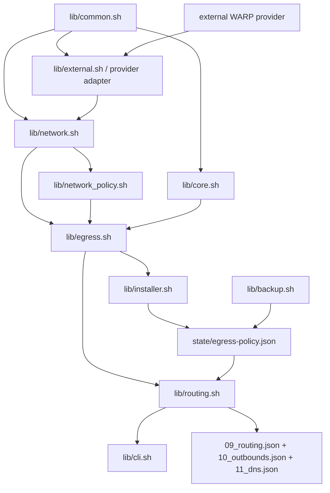

# IPv4/IPv6 与 WARP 四出口架构方案

> 状态：已实现单栈补全的对称默认优先级、名单“或”匹配和 UDP 双栈选择；真实核心定向测试通过，不代表三类公网部署的完整验收
>
> 原始需求与现状基线：[IPv4/IPv6 与 WARP 出站现状基线](network-egress-current-state.md)
> 工程约束：仓库根目录 `AGENTS.md` 的“铁律十三条”

本文定义 xray-agent 全新安装时的网络出站目标模型、模块边界、实施阶段、验证矩阵和回滚。实现不得绕开现状基线中的问题，也不得在新安装路径旁保留旧模型并行逻辑。旧安装升级和历史配置迁移明确不在范围内。

当前仓库实现：`lib/network.sh` 负责事实探测，`lib/network_policy.sh` 只管理项目拥有的补充路由，`lib/egress.sh` 生成出口目录和 Freedom outbound，`lib/routing.sh` 以 `egress-policy.json` 为唯一策略源。仓库已删除旧模板、旧 routing profile 和运行时旧标签生成路径，但这不代表历史部署已同步更新。

## 1. 架构决策

核心产品目标只有三项：

1. **一键中国大陆分流**：用户可一键开启或关闭“中国大陆网站或目标 IP 走 WARP”。域名和 IP 任一命中即可，菜单不要求用户理解或手工拆分底层规则；关闭时只撤销该项分流，不卸载 WARP，也不删除用户自定义名单。
2. **单栈补全双栈**：通过现有外部 WARP 脚本，为原生仅 IPv4 或仅 IPv6 的服务器补充缺失的公网地址族。xray-agent 负责调用、验证与出站集成，不自行维护 WARP 安装实现；完成后必须实测补充的地址族可用。
3. **用户自主选择出口**：用户可选择默认流量是否使用 WARP，也可维护需要走 WARP 的域名名单并撤销选择。未指定走 WARP 的流量遵循当前默认策略；若缺少对应原生地址族，则不能承诺关闭 WARP 后该地址族仍然可达，不得假装直连或静默改换出口。

四出口目录、地址族优先级、策略文件和底层路由都是实现这三项能力的内部机制，不应让用户为每个网站创建专用管理方式。中国大陆分流是用户可选能力，不是所有安装都必须开启的强制默认项。这里的域名/IP 分流作用于经过 Xray 的流量，系统级 WARP 范围另见第 5.1 节。

不再把 `IPv4-out` / `IPv6-out` 当成完整出口身份。建立统一“出口目录（egress catalog）”，把以下维度分别建模：

```text
出口提供者：system / native / warp
地址族：IPv4 / IPv6 / auto
作用范围：Linux 系统 / Xray 默认 / Xray 规则
请求类型：TCP / UDP
可用状态：available / unavailable + reason
```

目标不是为十五种场景各写一套分支，而是由同一个运行时目录根据实际接口、路由、源地址和 Xray 版本计算可用出口。

### 1.1 WARP 提供者边界

WARP 安装继续使用当前外部脚本。xray-agent 不维护该脚本的分叉或复制版本，而是在项目内维护稳定的网络集成层。

| 所有者 | 唯一职责 |
| --- | --- |
| 外部 WARP 脚本 | 安装、更新、卸载、注册、账户、Endpoint、WireGuard 基础配置，以及脚本提供的全局/非全局模式 |
| xray-agent 网络层 | 外部调用适配、实时状态发现、能力归一化、项目自有补充策略路由、出口目录和 Xray 路由配置 |
| Linux 内核状态 | 接口、地址、路由和策略规则是否真实生效的最终事实来源 |

硬边界：

- 不复制、分叉或内嵌维护外部脚本实现。
- 不直接改写外部脚本生成的 WireGuard 配置和基础路由。
- xray-agent 新增的策略路由必须使用独立表、优先级和所有权清单，只能清理自己创建的资源。
- 外部脚本变化通过适配和能力探测消化，不能把固定接口名、文件名或规则形态写成业务真相。

### 1.2 单栈补全的对称出口规则

适用前提：原生仅有一个可用公网地址族，WARP 提供可用双栈，系统默认路由已配置为“原生地址族走原生，缺失地址族走 WARP”。不能只根据网卡存在私网地址就认定具备原生公网能力。

在保留私网阻断和用户黑名单的前提下，先判断是否命中已启用的 WARP 分流，再处理普通流量。下表描述用户启用中国大陆分流、配置自定义 WARP 名单，并选择普通流量沿系统默认路径时的行为；未启用的分流项不参与匹配：

| 请求条件 | 原生 IPv6 + WARP 双栈 | 原生 IPv4 + WARP 双栈 |
| --- | --- | --- |
| 中国大陆域名、中国大陆目标 IP 或自定义 WARP 名单 | WARP 出口 | WARP 出口 |
| 未命中名单的 IPv4 目标 | WARP IPv4 | 原生 IPv4 |
| 未命中名单的 IPv6 目标 | 原生 IPv6 | WARP IPv6 |
| 双栈域名的首选地址族 | IPv6 优先 | IPv4 优先 |

该首选地址族应作为这两类场景的初始策略，默认出站与 WARP 名单出站保持一致，用户仍可显式调整。原生双栈环境不能由此推导唯一优先级，应保留明确选择。

- “优先”不是“强制”：IP 字面量保持目标地址族；只有单地址族的域名仍应能经该地址族的可用路径连接。不得把强制单栈出口包装成双栈优先。
- 名单决定提供者，优先级决定可选目标地址的尝试顺序。名单内连接不得为了另一地址族而离开 WARP。
- TCP 与 UDP 遵守相同的提供者和地址族映射，连接机制可以不同。UDP 不使用 Happy Eyeballs，不构成一律强制 IPv4 或 IPv6 的理由。
- 不新增网站专用管理机制。普通域名应加入既有 WARP 域名列表，覆盖主域及子域时采用 `domain:` 语义；与 `geosite` 列表共用规则管理入口。

### 1.3 当前实现与验收边界

以下列出第 1.2 节的实现及仍需区分的验证边界：

| 项目 | 当前实现或风险 | 目标 |
| --- | --- | --- |
| 初始地址族优先级 | 原生仅 IPv6 时初始 IPv6 优先；原生 IPv4 场景初始 IPv4 优先 | 允许用户通过默认出口菜单调整 |
| UDP 出口 | 自动出口按首选地址族解析，无该族记录时查询另一族；IP 字面量保持地址族 | 不承诺不可达后重试或 TCP 式竞速 |
| 中国大陆与名单匹配 | 统一策略经生成器拆为独立域名/IP 规则，TCP/UDP 均支持 | 任一条件命中即可；独立开关不删除用户名单 |
| 普通域名输入 | 裸域名规范化为 `domain:`，裸列表名规范化为 `geosite:` | 共用名单入口，拒绝 URL 和路径 |
| 管理一致性 | 旧版管理脚本与新格式配置混用，或只手工改运行配置，会使菜单与实际行为脱节 | 已支持安装路径中，脚本、策略源和派生配置必须一致；不据此新增历史迁移功能 |

定向真实核心测试覆盖两种首选、单族域名、IP 字面量、域名/IP 任一匹配及 TCP/UDP 私网阻断。隔离环境中的提供者共用测试接口，因此仍需公网部署核对实际出口身份。服务 active、首页返回成功或临时代理探测成功，不能替代真实客户端入口、UDP 和脚本管理能力的验收。

## 2. 铁律十三条映射

| 铁律 | 本方案约束 | 验证方式 |
| --- | --- | --- |
| 1. 用户目标为纲 | 四出口、三层全局语义和节点 A/B/双栈场景是范围边界 | 所有验收项回链现状基线第 10 节 |
| 2. 复杂任务先谋 | 先完成本文，再按阶段实施；阶段失败即停止并重谋 | 每阶段独立计划、测试和状态更新 |
| 3. 当览全局经纬 | 同时处理 Linux 路由、Xray 路由、DNS、Freedom 和 WARP | 依赖图与十五场景矩阵完整覆盖 |
| 4. 先穷问题本源 | 修复“地址族不等于出口身份”和 Freedom 预解析根因 | 不以调整 outbound 顺序代替出口模型 |
| 5. 模块划分清晰 | 网络探测、出口目录、策略编排、外部 WARP 安装分责 | 模块不反向依赖、不重复探测 |
| 6. 凡可复用皆用 | 所有 Freedom 出站由一个构建器生成 | 删除重复的 IPv4/IPv6/WARP 模板 |
| 7. 同类惟存一式 | `egress-policy.json` 是用户策略唯一来源 | Xray JSON 只作为派生产物，不双向编辑 |
| 8. 方案师出有名 | 使用 Xray 官方 Sockopt、路由和 Linux 策略路由范式 | 文档保留上游链接和版本证据 |
| 9. 不存冗余代码 | 新安装只保留新出口模型，删除旧标签、旧 profile 和旧模板 | 检查新安装路径无旧实现引用 |
| 10. 不设有毒兜底 | 指定出口不可用时拒绝应用，不静默走其他出口 | 故障测试必须保持旧配置和旧服务 |
| 11. 不作枚举命中 | 从接口、路由和配置事实发现出口，不按 VPS/IP/接口名特判 | 测试使用任意接口名和地址 |
| 12. 小步独立闭环 | 正确性、目录、策略、新安装、实机验证分阶段闭环 | 每阶段有命令、期望结果和回滚点 |
| 13. 文档随事同更 | 代码、菜单、配置格式、范围和经验同步更新 | 每阶段同时更新 docs 与 lessons.md |

## 3. 目标领域模型

### 3.1 物理出口

| 稳定 ID | 含义 | 可用条件 |
| --- | --- | --- |
| `native-ipv4-out` | 明确使用原生 IPv4 | 存在原生 IPv4 源地址、接口及可验证路由 |
| `native-ipv6-out` | 明确使用原生 IPv6 | 存在原生 IPv6 源地址、接口及可验证路由 |
| `warp-ipv4-out` | 明确使用 WARP IPv4 | WARP 接口 IPv4 可用，接口策略路由有效 |
| `warp-ipv6-out` | 明确使用 WARP IPv6 | WARP 接口 IPv6 可用，接口策略路由有效 |

### 3.2 自动出口

| 稳定 ID | 含义 | 典型用途 |
| --- | --- | --- |
| `system-auto-out` | 按 Linux 当前 IPv4/IPv6 有效默认路由进行 TCP 双栈竞速 | 节点 A 的 `N4/W6`、节点 B 的 `W4/N6` |
| `native-auto-out` | 在同一原生双栈出口内竞速 | 原生双栈 VPS |
| `warp-auto-out` | 在同一 WARP 双栈接口内竞速 | WARP 双栈专用接口或 WARP 双栈默认出口 |

自动出口的 Happy Eyeballs 能力只适用于目标为双栈域名的 TCP；单地址族域名及 IP 字面量沿对应地址族连接。它不是跨任意两个 outbound 的通用故障转移器，也不会根据 HTTP 403 等应用层响应自动换出口重试。UDP 使用独立派生出站，见第 6.2 节。

### 3.3 阻断出口

保留一个统一 `blackhole-out`。私网、回环、未指定地址和用户黑名单统一通过 Xray 路由进入该出口，不在多个 Freedom 出站中复制安全规则。

### 3.4 运行时出口目录

运行时目录由探测事实生成，不持久化接口状态：

```json
{
  "id": "native-ipv4-out",
  "provider": "native",
  "family": "ipv4",
  "interface": "eth0",
  "sourceAddress": "192.0.2.10",
  "available": true,
  "reason": "",
  "effectiveDefault": false
}
```

`interface` 和 `sourceAddress` 仅为示例。实现必须动态探测，不能假定原生接口叫 `eth0`、WARP 接口叫 `warp` 或 `wgcf`。

## 4. 策略唯一来源

新增运行时策略文件：

```text
/etc/xray-agent/state/egress-policy.json
```

当前 schema 示例：

```json
{
  "schemaVersion": 2,
  "defaultTcpEgress": "system-auto-out",
  "defaultPreference": "ipv6",
  "defaultUdpEgress": "system-auto-out",
  "rules": [
    {
      "id": "openai-via-warp",
      "match": {
        "domain": ["geosite:openai"]
      },
      "tcpEgress": "warp-auto-out",
      "preference": "ipv6",
      "udpEgress": "warp-auto-out"
    }
  ]
}
```

约束：

- 该文件是脚本管理策略的唯一来源。
- schema 2 使用共享 `defaultPreference` / `preference` 表达 TCP 与 UDP 的地址族优先级，替代 schema 1 的 `defaultTcpPreference` / `tcpPreference`。旧 schema 会被拒绝，不自动迁移。
- `09_routing.json`、`10_outbounds.json` 和 `11_dns.json` 是派生产物。
- 用户选择不可用出口时拒绝保存和应用。
- Linux 系统 WARP 全局模式是外部观测事实，不复制进策略文件。
- 项目自有网络资源清单是派生的所有权记录，不是第二份用户策略源。
- 备份与恢复必须包含该文件。
- 菜单读取、修改、删除与重新生成必须基于同一策略源。临时诊断和回滚文件不得成为第二条配置生成或常驻覆盖路径。

## 5. 三层控制面

### 5.1 Linux 系统 WARP

菜单 `20` 继续作为外部 WARP 安装/全局模式入口。本阶段不重新实现 WARP 注册、Endpoint 选择、账户管理和基础 WireGuard 路由，避免复制成熟外部项目。

xray-agent 网络集成层承担：

- 外部脚本调用适配，但不维护其内部实现。
- 外部操作返回后的网络刷新。
- WARP 接口、地址和策略路由验证。
- 原生公网源地址回程规则验证。
- 把验证结果提供给出口目录。
- 为明确的 Xray 出口管理独立、可回滚的补充策略路由。

补充策略路由必须记录所有权、幂等应用并只删除自身资源。若外部 WARP 路由不满足某个出口条件，该出口标记为不可用；不得自动补写未知版本的外部配置。

系统默认路由决定普通本机请求各地址族的出口，不等于系统级域名分流。Xray 名单只影响进入 Xray 的流量，不会自动作用于包管理器、普通 `curl` 或其他本机程序。“整机地址族优先”还涉及系统地址排序与应用自身的解析、拨号行为，不能由 Xray 的首选开关保证。若要求所有本机程序也执行域名名单，需要另行明确系统级流量接管范围，不得宣称现有 Xray 规则已经覆盖。

### 5.2 Xray 默认出站

菜单 `6` 为“默认 Xray 出站”：

- 常用入口同时设置 TCP/UDP 默认出口和共享地址族优先级。
- 高级入口只覆盖 UDP 默认出口，沿用共享优先级。

菜单必须展示解析后的实际路径，例如：

```text
system-auto-out: IPv4=原生/eth0，IPv6=WARP/warp
```

默认行为使用显式末尾 `network: tcp` / `network: udp` 规则，不再只依赖 outbound 数组顺序表达用户策略。第一个 outbound 仍保持安全、可运行的默认值，但不作为策略唯一载体。

### 5.3 Xray 规则分流

统一规则结构应支持现有和后续条件：

- 域名、`geosite`。
- IP、`geoip`。
- 入站标签。
- 用户。
- TCP/UDP。
- 端口。

第一版只开放域名、CN 和黑名单能力；新增匹配类型按真实需求逐步开放，不一次堆满菜单。

WARP 分流的领域语义是“中国大陆域名 **或** 中国大陆目标 IP **或** 自定义名单”。Xray 在同一 `RuleObject` 中对不同属性采用同时满足语义，因此生成器应按需要输出独立的域名规则和 IP 规则，并复用同一出口；不应要求用户为每个站点维护新的策略类别。底层规则拆分不意味着第二套管理系统，也不得留下策略文件与派生配置表达不同含义的状态。匹配顺序应保留安全阻断在前、WARP 分流其次、默认出口兜底。[Xray 路由匹配语义](https://xtls.github.io/config/routing.html#ruleobject)

## 6. Happy Eyeballs 与安全边界

### 6.1 根因处理

Xray-core `v26.5.3+` 的 Freedom 默认安全规则可能在 `sockopt` 前解析域名，导致 Happy Eyeballs 失效。目标实现不能只修改版本门槛。

候选正确链路：

```text
Xray routing.domainStrategy=IPOnDemand
-> 私网/回环/未指定地址规则进入 blackhole-out
-> Freedom finalRules 首条为无条件 allow，避免 Freedom 再次预解析
-> Freedom settings.domainStrategy=AsIs
-> sockopt.domainStrategy=UseIP
-> sockopt.happyEyeballs
```

这样由 Xray 路由层承担私网安全边界，同时保留原始域名给 `sockopt`。实施前必须用真实 Xray-core 版本验证以下事实：

1. 路由解析不会改写最终目标地址。
2. 私网和回环目标仍被阻断。
3. VLESS、VMess、Trojan、Hysteria2 入站的双栈域名确实进入 Happy Eyeballs。
4. `v25.6.8`、`v26.5.9` 和当前正式版行为均有明确结论。

真实 VLESS 入站测试已在 Xray-core `v25.6.8`、`v26.5.9` 和 `v26.7.28` 验证双向首选/回退与私网阻断。后续核心版本仍必须复跑同一测试；测试失败时不得发布“自动回退”。

### 6.2 UDP

UDP 不使用 Happy Eyeballs。自动出口使用独立标签及 Freedom `ForceIPv6v4` / `ForceIPv4v6`：优先查询指定地址族，没有该族 DNS 记录才查询另一族；目标为 IP 时保持原地址族。提供者绑定与 TCP 一致，WARP 名单不会跨提供者回退。

用户仍可显式选择以下单地址族出口：

```text
native-ipv4-out / native-ipv6-out / warp-ipv4-out / warp-ipv6-out
```

用户明确要求强制单族时，目标不支持所选地址族应失败，不静默改变提供者。但第 1.2 节的双栈补全场景不能默认强制单族：普通 UDP 应按目标地址族使用系统已有路径，名单内 UDP 应使用 WARP 的对应地址族。

双栈 UDP 不具备连接竞速或不可达后的另一族重试保证。真实核心测试覆盖双栈首选、单族域名、字面量和规则分流；不能将这些结果扩大为 UDP 网络故障自动回退已实现。

## 7. 模块划分

### 7.1 `lib/network.sh`

保留通用只读网络原语：

- 路由查询。
- 接口地址查询。
- 公网地址探测。
- 回环和默认路由探测。

WARP 接口发现不再依赖接口名称枚举，而是优先从活动 WireGuard 配置、服务和实时路由关系推导。

### 7.2 `lib/network_policy.sh`（新增）

单一职责：管理 xray-agent 自己拥有的 Linux 策略路由。

- 使用项目保留的路由表和规则优先级。
- 根据已验证的接口、源地址和出口要求幂等应用规则。
- 把已创建资源写入运行时所有权清单。
- 回滚和卸载时只删除所有权清单中的资源。
- 不修改 WireGuard 配置，不接管外部脚本的基础路由。

### 7.3 `lib/egress.sh`（新增）

单一职责：构建出口目录并生成 Freedom outbound JSON。

公开边界建议：

```text
xray_agent_egress_catalog_json
xray_agent_egress_get
xray_agent_egress_validate_selection
xray_agent_egress_outbound_json
xray_agent_egress_effective_path_label
```

所有原生/WARP、IPv4/IPv6/auto Freedom 出站共用一个构建器。新模型稳定后删除重复模板。

### 7.4 `lib/routing.sh`

只负责：

- 读取和验证 `egress-policy.json`。
- 把规则映射到出口 ID。
- 原子生成 Xray routing/outbounds。
- 菜单交互和原子应用入口。

不再自行探测接口或拼接不同 Freedom 模板。

### 7.5 `lib/installer.sh`

新安装时：

1. 生成出口目录。
2. 选择安全的默认 TCP/UDP 策略。
3. 写入策略源文件。
4. 从策略生成 Xray 配置。

### 7.6 `lib/external.sh`

作为外部 WARP 提供者的薄适配层，保留下载和运行入口。它只负责调用、退出状态和操作后的刷新编排，不复制外部实现，不解析未承诺的内部细节，也不生成 Xray 出站。

### 7.7 `lib/backup.sh` 与打包路径

把 `state/egress-policy.json` 纳入备份、恢复和安装布局。恢复时先校验 schema 和当前出口可用性，再生成 Xray 配置。

### 7.8 测试

| 路径 | 职责 |
| --- | --- |
| `tests/egress_catalog_test.sh` | 模拟接口、地址、绑定公网响应和 WARP 身份，验证出口目录 |
| `tests/network_policy_test.sh` | 验证项目策略路由幂等、所有权隔离和精确清理 |
| `tests/egress_policy_test.sh` | 验证策略 schema、选择和规则生成 |
| `tests/xray_freedom_integration_test.sh` | 使用真实 Xray 二进制验证 finalRules、私网阻断和 Happy Eyeballs |
| `tests/egress_integration_test.sh` | 隔离网络中经真实 VLESS 入站验证 TCP/UDP 双栈优先、单族域名、字面量和域名/IP 或匹配；保留配置、日志和结果 |

## 8. 依赖关系



禁止依赖：

- `network.sh` 不依赖 `routing.sh`。
- `network_policy.sh` 不修改外部 WireGuard 配置或无所有权记录的路由。
- `egress.sh` 不执行菜单交互。
- `routing.sh` 不直接修改 WireGuard 配置。
- `external.sh` 不承载 WARP 安装实现。
- 外部 WARP 脚本不成为 Xray 配置的隐式唯一来源。

## 9. 统一命名

| 类型 | 规则 |
| --- | --- |
| 稳定出口 tag | `<provider>-<family>-out` 或 `<provider>-auto-out` |
| Shell 函数 | `xray_agent_egress_*` |
| 策略文件字段 | lower camel case，与现有 JSON 风格一致 |
| 规则 ID | 用户可读、稳定、唯一，不使用数组位置作身份 |
| 菜单文案 | 同时显示提供者、地址族、接口和可用状态 |

全新安装不识别也不生成旧的 `IPv4-out` / `IPv6-out` 标签。

## 10. 实施阶段

### 阶段 0：现状与方案基线（完成）

目标：固化需求、缺陷、十五场景和铁律映射。

路径：

- `docs/network-egress-current-state.md`
- `docs/network-egress-design.md`
- `docs/network-routing.md`
- `lessons.md`

验收：Markdown 链接可解析，文档不含真实 VPS 凭据，`git diff --check` 通过。

### 阶段 1：先修正确性（完成）

目标：在不引入四出口前，先解决 Happy Eyeballs/finalRules 和 geosite 输入契约。

预计路径：

- `lib/core.sh`
- `lib/routing.sh`
- `lib/egress.sh`
- `templates/xray/base/09_routing.json.tpl`
- `tests/xray_freedom_integration_test.sh`

验收：

- 私网目标仍阻断。
- TCP 双栈域名在目标版本真实发生首选/回退。
- UDP 文案和行为不宣称自动回退。
- `geosite:openai` 和 `openai` 都规范化为一个 `geosite:openai`。

### 阶段 2：出口目录（完成）

目标：同一模型生成物理和自动出口，不修改用户策略菜单。

预计路径：

- `lib/egress.sh`
- `lib/network.sh`
- `lib/network_policy.sh`
- `lib/runtime.sh`
- `tests/egress_catalog_test.sh`
- `tests/network_policy_test.sh`

验收：十五种系统组合生成正确、可解释的目录；随机接口名测试通过；不可用出口包含明确原因；项目策略路由重复应用不产生重复项，清理操作不影响外部脚本资源。

### 阶段 3：策略源与菜单（完成）

目标：建立 `egress-policy.json`，分别控制 TCP、UDP 和规则出口。

预计路径：

- `lib/egress.sh`
- `lib/routing.sh`
- `lib/installer.sh`
- `lib/cli.sh`
- `lib/backup.sh`
- `packaging/install-layout.sh`
- `tests/egress_policy_test.sh`

验收：策略文件是唯一来源；生成配置可重复；相同输入产生相同输出；不可用选择不会写配置。

### 阶段 4：删除旧模型（完成）

目标：让全新安装只经过新策略源，删除旧模板、profile 和调用路径。

预计删除或收敛：

- `templates/xray/outbounds/freedom_ipv4.json.tpl`
- `templates/xray/outbounds/freedom_ipv6.json.tpl`
- `templates/xray/outbounds/freedom_ipv4_legacy.json.tpl`
- `templates/xray/outbounds/freedom_ipv6_legacy.json.tpl`
- `templates/xray/outbounds/warp_out.json.tpl`
- `templates/xray/outbounds/cn_out.json.tpl`
- 仅服务于旧出站顺序的 routing profile 字段和分支

验收：`rg` 不再发现旧标签的运行时生成路径；新安装不读取历史出站文件；仓库不存在长期双轨。

### 阶段 5：实机闭环（局部验证已有记录，完整目标待验收）

目标：在三类真实 VPS 上完成只读基线、全新安装、测试和回滚演练。

节点：

1. 原生 IPv4 + WARP IPv6。
2. 原生 IPv6 + WARP IPv4。
3. 原生双栈 + WARP 双栈。

验收：每个节点验证四出口中实际可用的集合、TCP/UDP、域名/IP 字面量、系统全局和 Xray 分流；公网入站连接在 WARP 模式切换后保持回程正常。

已有局部验证覆盖只读基线、绑定接口公网识别、候选配置测试、备份、服务恢复和网络状态不变检查，以及部分 TCP 域名请求。这些记录不证明原生地址族优先、名单“或”匹配、完整 UDP/IP 字面量矩阵和菜单管理一致性已经通过。两类单栈补全场景须按第 1.2 节重新核对相关缺口；原生双栈场景和系统 WARP 模式切换也仍需实机验证。公开文档只记录网络类型、期望行为和验证范围，不记录具体部署身份、地址或凭据。

## 11. 全新安装与原子应用

### 11.1 范围

安装过程只根据当前网络事实创建新的 `egress-policy.json`、`09_routing.json`、`10_outbounds.json` 和 `11_dns.json`。它不读取、不映射、不删除历史出口文件；旧安装升级由用户另行处理。

### 11.2 原子应用

1. 在临时目录生成策略文件和 Xray JSON。
2. 执行 JSON 检查和 Xray 配置测试。
3. 绑定目标接口执行公网请求，并核对返回地址族与原生/WARP 身份。
4. 原子替换策略与配置。
5. 重载 Xray。
6. 检查服务和关键日志。

任一步失败都保留旧配置，不执行“尽量启动”的有毒兜底。

## 12. 验证矩阵

每个可用出口至少覆盖：

| 请求 | 必验结果 |
| --- | --- |
| TCP 双栈域名 | 首选地址族和回退顺序符合策略 |
| TCP A-only 域名 | 使用对应 IPv4 出口或明确失败 |
| TCP AAAA-only 域名 | 使用对应 IPv6 出口或明确失败 |
| TCP IPv4 字面量 | 只使用指定 IPv4 出口 |
| TCP IPv6 字面量 | 只使用指定 IPv6 出口 |
| UDP IPv4 | 普通请求使用场景对应 IPv4 出口；命中名单使用 WARP IPv4 |
| UDP IPv6 | 普通请求使用场景对应 IPv6 出口；命中名单使用 WARP IPv6 |
| 私网/回环 | 按安全策略阻断 |
| WARP 中断 | WARP 指定出口明确失败，不静默改走原生 |
| 原生路由中断 | 原生指定出口明确失败，不静默改走 WARP |

十五种系统组合通过模拟测试；三类代表节点通过实机测试。测试结果必须记录“期望出口”和“实际公网出口”，不能只检查 Xray 服务是否启动。

## 13. 风险与明确边界

### 13.1 Freedom 安全规则

为保留 Happy Eyeballs 而配置无条件 `finalRules allow` 会改变 Xray 新版默认私网保护。只有路由层私网阻断经过真实测试后才能采用。

### 13.2 WARP 全局后的原生绕行

绑定原生接口不等于一定绕过 WARP，接口存在地址或 `ip route get` 返回路径也不等于公网可用。Xray 使用的 `SO_BINDTODEVICE` 又可能与普通 `ip route get ... oif ... from ...` 结果不同，因此最终必须以绑定接口的真实公网请求和 provider 身份为准；失败的原生出口应标记不可用，不能静默借用 WARP。

### 13.3 外部 WARP 脚本

外部项目会更新路由生成方式。xray-agent 只维护调用适配和网络集成，不维护外部实现；只能相信实时内核状态和配置验证，不能相信某个外部版本一定生成固定文件或接口名。任何项目自有补充路由都必须与外部资源隔离并支持精确回滚。

### 13.4 跨出口故障转移

Happy Eyeballs 是同一个 dialer 对多个目标地址的 TCP 竞速，不是任意 outbound 链的健康检查。第一版不实现 `native-ipv4-out -> warp-ipv6-out` 这种跨 outbound 自动故障转移；节点 A/B 使用 `system-auto-out` 表达系统已存在的混合地址族路由。

### 13.5 旧安装边界

旧 tag、旧策略文件和用户自定义旧规则不会自动迁移。全新安装只生成新模型，不提供兼容 shim；用户必须在独立备份后重新配置。

## 14. 完成定义

只有同时满足以下条件，才能宣称“灵活控制 IPv4/IPv6 与原生/WARP 出口”完成：

1. 四个物理出口可独立发现、选择和验证。
2. 三个自动出口只在满足条件时出现。
3. TCP、UDP 策略分离。
4. 系统全局、Xray 默认和规则分流语义分离。
5. Happy Eyeballs 在目标 Xray 版本真实生效。
6. 私网安全边界没有因 Happy Eyeballs 修复而丢失。
7. 十五种组合和请求矩阵通过。
8. 三类代表节点完成实机闭环。
9. 新安装路径中的旧模型已删除，且不存在迁移兼容分支。
10. 用户文档、菜单文案、配置说明和 lessons.md 同步完成。
